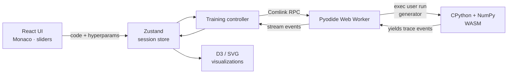

# AlgoVisualizer

> Edit real Python machine-learning code in your browser and watch the algorithm train, step by step, on real datasets.

AlgoVisualizer is an interactive, fully client-side playground for understanding how
classic ML algorithms actually work. Pick an algorithm, tweak a hyperparameter (or rewrite
the Python directly), and watch each iteration unfold — centroids moving, decision
boundaries warping, trees splitting, loss curves descending — with a plain-English
explanation and the matching math for every step.

Everything runs in the browser. The Python executes on **[Pyodide](https://pyodide.org/)**
(CPython compiled to WebAssembly), so there is no backend, no install, and your code never
leaves the page.

- **Live demo:** deploy your own in one click — see [Deployment](#deployment).
- **Tech:** React 18 · TypeScript · Vite · Pyodide · D3 · Zustand · Tailwind CSS · Monaco.

---

## Table of contents

- [Features](#features)
- [How it works](#how-it-works)
- [Tech stack](#tech-stack)
- [Getting started](#getting-started)
- [Available scripts](#available-scripts)
- [Project structure](#project-structure)
- [The trace-event contract](#the-trace-event-contract)
- [Extending it](#extending-it)
- [Deployment](#deployment)
- [Performance](#performance)
- [Analytics](#analytics)
- [Documentation](#documentation)
- [License](#license)

---

## Features

- **18 algorithms across 4 categories** — supervised classification, supervised
  regression, unsupervised clustering, and dimensionality reduction. Each ships with
  editable Python, a canonical scikit-learn reference, complexity notes, pros/cons, and
  curated reading links.
- **Editable, runnable code** — a Monaco editor holds the real Python. Edit it and the
  visualization re-runs automatically (debounced).
- **Hyperparameter sliders** — drag a slider and it patches the exact value in the source,
  then re-runs. A "sweep" mode runs the algorithm across a range of values.
- **Step-by-step playback** — scrub, play, pause, and change speed. Every step carries an
  explanation and a LaTeX math expression.
- **12 datasets** — real (Iris, Wine) and synthetic (blobs, moons, circles, spirals,
  Gaussian mixtures, linear/polynomial trends, and small image shapes for the CNN).
- **Algorithm Race** — run several algorithms side by side on the same dataset.
- **Quiz mode** — hides the "what's happening" panel so you can predict the next step.
- **Responsive** — adapts from a three-column desktop workspace to a tabbed mobile layout.
- **Zero backend** — static hosting only; all computation is client-side.

## How it works



1. Each algorithm is a small Python module exposing a generator
   `run(X, y=None, **kwargs)` that **yields plain dicts** describing each step.
2. The user's code runs inside a Web Worker on Pyodide, so the heavy WASM work never
   blocks the UI thread. The main thread talks to the worker via
   [Comlink](https://github.com/GoogleChromeLabs/comlink).
3. Every yielded dict is a **trace event** with a `type` (e.g. `kmeans:assign`), a `step`,
   an `explanation`, and `math`, plus algorithm-specific payload. Events stream back to the
   store as they are produced.
4. A family-specific renderer reshapes each event into D3/SVG (scatter plots, decision-
   boundary contours, tree diagrams, loss charts, etc.).

See [`docs/ARCHITECTURE.md`](docs/ARCHITECTURE.md) for the full design.

## Tech stack

| Concern            | Choice                                                        |
| ------------------ | ------------------------------------------------------------- |
| UI                 | React 18 + TypeScript                                         |
| Build tool         | Vite 5                                                        |
| Python runtime     | Pyodide (CPython + NumPy, compiled to WebAssembly)            |
| Worker bridge      | Comlink                                                       |
| State              | Zustand (with `subscribeWithSelector`)                        |
| Code editor        | Monaco (`@monaco-editor/react`)                               |
| Visualization      | D3 + hand-rolled SVG; Recharts for loss curves                |
| Math typesetting   | KaTeX (`react-katex`)                                         |
| Styling            | Tailwind CSS; Google Material Symbols (subsetted)             |
| Routing            | React Router                                                  |

## Getting started

### Prerequisites

- **Node.js 18+** and npm.

### Install & run

```bash
git clone https://github.com/dhruv-15-03/AlgoVisualizer.git
cd AlgoVisualizer
npm install
npm run dev
```

Open the printed URL (default `http://localhost:5173`). The first algorithm run downloads
the Pyodide runtime (~10 MB) once; subsequent runs are instant.

## Available scripts

| Script              | What it does                                            |
| ------------------- | ------------------------------------------------------- |
| `npm run dev`       | Start the Vite dev server with HMR.                     |
| `npm run build`     | Type-check (`tsc --noEmit`) then build to `dist/`.      |
| `npm run preview`   | Serve the production build locally.                     |
| `npm run lint`      | ESLint over `ts`/`tsx` (zero warnings allowed).         |
| `npm run typecheck` | Type-check only, no emit.                               |

## Project structure

```
src/
├─ algorithms/        # Per-algorithm metadata (*.ts) + Python source (python/*.py)
│  └─ registry.ts     # Single source of truth for the algorithm picker
├─ controllers/       # Glue between the store and the Pyodide worker
├─ datasets/          # Built-in + synthetic datasets and their registry
├─ pages/             # Route entry points (Home, Workspace, Race)
├─ stores/            # Zustand stores (session, race)
├─ types/             # Shared types — trace events are the core contract
├─ visualizations/    # Family-specific D3/SVG renderers + VizRouter
├─ workers/           # Pyodide Web Worker + its Comlink client
└─ components/        # UI primitives (ui/) and workspace panels (workspace/)
docs/                 # Architecture notes and the original wireframe
```

## The trace-event contract

The boundary between Python and the renderer is one TypeScript file:
[`src/types/trace.ts`](src/types/trace.ts). Every Python `run()` generator yields dicts
that match one of the `TraceEvent` shapes. For example, K-Means yields:

```python
yield {
    "type": "kmeans:assign",
    "step": step,
    "labels": labels.tolist(),
    "inertia": inertia,
    "explanation": "Each point assigned to its nearest centroid.",
    "math": r"c_i = \arg\min_j \| x_i - \mu_j \|^2",
}
```

The `type` prefix (`kmeans`, `boundary`, `cluster`, `projection`, …) selects which
renderer draws the step. Adding a new algorithm usually means reusing one of the generic
families (`boundary` for any 2-D classifier, `cluster` for clustering, `projection` for
dimensionality reduction) so no new renderer is needed.

## Extending it

Adding an algorithm or dataset is intentionally mechanical. The full step-by-step guide —
including the trace families you can reuse and the one manual step the build can't check
for you (the Material Symbols icon subset) — lives in
[`CONTRIBUTING.md`](CONTRIBUTING.md).

## Deployment

The app is a static SPA and deploys to any static host. It is preconfigured for **Vercel**
via [`vercel.json`](vercel.json):

1. Push to GitHub.
2. Import the repo at [vercel.com/new](https://vercel.com/new) — Vite is auto-detected
   (build `npm run build`, output `dist`). No environment variables are required.

`vercel.json` adds an SPA rewrite so deep links like `/workspace/kmeans` resolve to
`index.html` instead of 404-ing, and sets a one-year immutable cache on fingerprinted
`/assets/*`.

## Performance

The initial Home payload is kept small (~115 KB gzipped) through:

- **Route-level code splitting** — `WorkspacePage` and `RacePage` (which pull in Monaco,
  KaTeX, D3, and the worker) are lazy-loaded; Home ships only the entry + React + router.
- **Vendor chunk splitting** — Monaco, charts (D3/Recharts), math (KaTeX), router, and
  React are split so a code change doesn't bust their long-lived caches.
- **Font subsetting** — Material Symbols is requested with an explicit `icon_names=` subset
  (~8.5 KB instead of ~600 KB) while keeping all four variable-font axes.
- **Idle prewarming** — while you read the Home page, the Workspace bundle and the Pyodide
  runtime download during browser idle time, so entering the workspace feels instant.

## Analytics

[Microsoft Clarity](https://clarity.microsoft.com) (anonymous session replay + heatmaps) is
loaded asynchronously from `index.html`. It never blocks the initial paint and masks form
input by default. The project id lives inline in `index.html`; remove that `<script>` block
to disable it.

## Documentation

- [`CONTRIBUTING.md`](CONTRIBUTING.md) — dev setup, code conventions, and how to add an
  algorithm or dataset.
- [`docs/ARCHITECTURE.md`](docs/ARCHITECTURE.md) — data flow, module responsibilities, and
  the worker boundary in depth.

## License

Released under the [MIT License](LICENSE).
