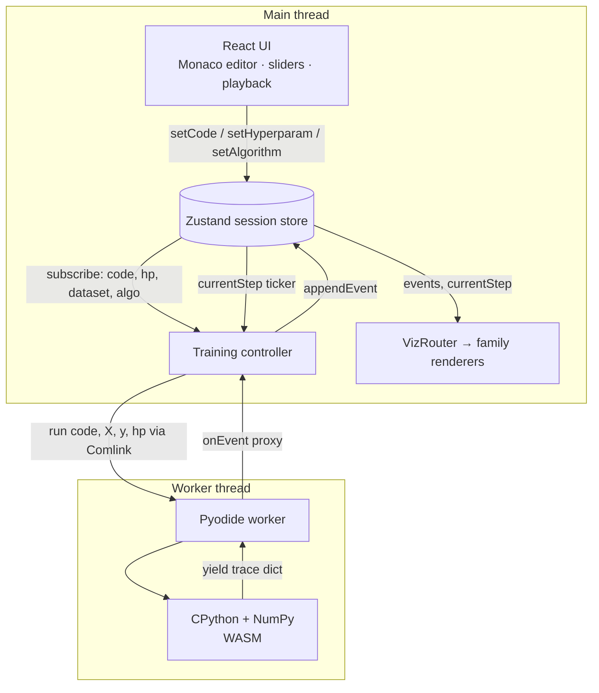

# Architecture

AlgoVisualizer is a fully client-side single-page app. There is no server: the user's
Python runs in the browser on Pyodide (CPython compiled to WebAssembly), and every
algorithm streams its progress to a React + D3 rendering layer through a single,
well-defined event contract.

## High-level data flow

The guiding principle: **the UI never computes anything heavy.** It mutates intent (code,
hyperparameters, selected dataset/algorithm) in the store; the controller turns intent into
worker runs; the worker streams trace events back; renderers are pure functions of
`(events, currentStep)`.

## Module responsibilities

| Module                         | Responsibility                                                                 |
| ------------------------------ | ------------------------------------------------------------------------------ |
| `src/pages/`                   | Route entry points. `Home` is eager; `WorkspacePage`/`RacePage` are lazy.      |
| `src/stores/session-store.ts`  | All session state: algorithm, dataset, code, hyperparams, events, playback.    |
| `src/controllers/training-controller.ts` | Subscribes to the store, debounces runs, drives the worker, runs the playback ticker. |
| `src/workers/pyodide.worker.ts` | Loads Pyodide + NumPy once; executes user code; iterates the generator.        |
| `src/workers/pyodide.client.ts` | Comlink wrapper that spawns and proxies the worker.                            |
| `src/types/trace.ts`           | The event contract — the single source of truth between Python and renderers.  |
| `src/visualizations/`          | One renderer per trace family, dispatched by `VizRouter`.                       |
| `src/algorithms/`              | Per-algorithm metadata (`*.ts`) + Python source (`python/*.py`) + `registry`.  |
| `src/datasets/`                | Built-in and synthetic datasets + `registry`.                                  |
| `src/components/`              | `ui/` primitives (Button, Panel, Icon, Slider, …) and `workspace/` panels.     |

## The store ⇆ controller boundary

State lives in a Zustand store created with `subscribeWithSelector`. The controller is
attached once (from `App`'s mount effect) and:

1. **Subscribes** to a selector over `{ algorithmId, datasetId, code, hyperparams }`. Any
   change triggers a **debounced** re-run (~350 ms) so typing in the editor or dragging a
   slider doesn't spawn a run per keystroke.
2. **Tokenises runs.** Each run takes a fresh `runToken` from the store. Events from a
   previous run that arrive after a newer run started are dropped, so stale output can never
   corrupt the current visualization.
3. **Drives playback.** A `requestAnimationFrame` ticker advances `currentStep` while
   `playing`, scaled by `speed`. Renderers read `currentStep` and draw the matching event.

## The worker boundary

Pyodide is heavy (~10 MB of WASM + the CPython heap), so it lives in a dedicated Web Worker
and is reused for the worker's lifetime. The main thread communicates with it via Comlink,
which makes the worker's `{ init, run, cancel }` API look like local async functions.

- `init(onProgress)` loads the runtime and NumPy once and reports staged progress back to
  the store (so the UI can show "Loading Python runtime…").
- `run(code, X, y, hp, onEvent)` execs the user's code in a fresh namespace, gets the
  `run()` generator, and iterates it. Each `next()` runs Python until the next `yield`;
  between yields the worker `await`s the `onEvent` proxy call, which is also where it checks
  the cooperative cancellation flag.
- `cancel()` sets that flag so a long run stops at the next yield boundary.

Cancellation is cooperative (checked between yields) rather than pre-emptive. Pre-emption
would need `SharedArrayBuffer`, which in turn needs COOP/COEP headers that block our CDN
resources — a trade-off documented in `vite.config.ts`.

## The trace-event contract

`src/types/trace.ts` defines every event shape. All events extend `BaseTraceEvent`
(`step`, optional `iteration`, `explanation`, `math`) and add a discriminating `type`
string of the form `family:phase` (e.g. `kmeans:assign`, `boundary:step`,
`cluster:converged`).

`familyOf(type)` extracts the family prefix, and `VizRouter` maps the family to a renderer.
This is why most new algorithms need no renderer: emitting `boundary:*`, `cluster:*`, or
`projection:*` events reuses an existing one.

Events arriving from Python are normalized in the controller (`normalizeEvent`) to guarantee
the `BaseTraceEvent` fields are present even if a generator omits them for brevity.

## Rendering pipeline

Each renderer is a React component that takes `{ dataset, events, currentStep }` and is a
pure function of those props:

- It selects the event at (or up to) `currentStep`.
- It builds D3 scales from the dataset / event payload and draws SVG.
- Layout sizing uses a `ResizeObserver` so visualizations are responsive without fixed
  dimensions.

All charts — including the loss/convergence curves — are hand-rolled SVG driven by D3
scales for full control over the step-by-step animation. The app ships a single charting
engine; there is no Recharts (or other charting library) dependency.

## Build & delivery

- **Vite** bundles the app. `vite.config.ts` defines `manualChunks` that split Monaco,
  charts (D3), math (KaTeX), router, and React into separate vendor chunks for
  cache stability.
- **Code splitting** keeps the Home payload minimal; the workspace/race bundles and the
  Pyodide runtime are prefetched during browser idle time from the Home page.
- **Material Symbols** is subsetted via an `icon_names=` query param in `index.html`.
- **`vercel.json`** provides the SPA rewrite and asset cache headers for static hosting.
