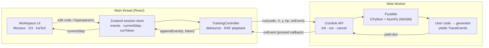

# Running 25 real machine-learning algorithms entirely in the browser — a CPython-in-WASM architecture case study

> **AlgoVisualizer** runs *actual* CPython machine-learning code — NumPy and all — inside your browser, streams every training step back as typed events, and animates them with plain-English + LaTeX explanations. No backend. No accounts. No "simulated" math. **25 algorithms · 20 datasets · 5 categories**, all client-side.
>
> **Live:** https://algo-visualizer-beige.vercel.app/ · **Code:** https://github.com/dhruv-15-03/AlgoVisualizer · **Stack:** React 18 · TypeScript · Vite · Pyodide (CPython→WASM) · Comlink · Zustand · D3 · Monaco · KaTeX · Tailwind

---

## TL;DR for the impatient

- **The hard part isn't the visuals — it's the contract.** Every algorithm is a Python *generator* that `yield`s typed trace events. A single discriminated-union `TraceEvent` type (12 event families) is the only thing the Python and the React sides agree on. Adding an algorithm = a new event family + a small renderer. The two halves never touch otherwise.
- **Real CPython, off the main thread.** Pyodide loads CPython + NumPy into a Web Worker. User code is `exec()`'d into a generator; the main thread pulls it one `yield` at a time over a Comlink RPC bridge, so steps **stream** instead of arriving in one blob. Each `PyProxy` is explicitly `.destroy()`'d to avoid leaking the WASM heap.
- **Concurrency correctness is handled, not hand-waved.** Every run gets a monotonic `runToken`; events from a superseded run are dropped at the store. Edit your code mid-run and the stale run can't corrupt the new one.
- **Performance is a budget, not a vibe.** The entry chunk was cut **63.9 kB → 31.9 kB gzipped (~50%)** by pushing Python sources, datasets, Monaco, D3 and KaTeX into lazy chunks — and a CI gzip **size budget** fails the build if anything heavy creeps back into the eager graph.
- **Production-hardened.** A strict CSP that allows WASM via `'wasm-unsafe-eval'` *without* opening `'unsafe-eval'` for JS; consent-gated analytics (off by default); a11y + Lighthouse gates in CI; and a family of "drift-guard" tests that make documentation lie *loudly* (CI fails) instead of silently.

If you only read one section, read **[The trace-event contract](#1-the-architecture-the-trace-event-contract)** — it's the decision the whole system hangs on.

---

## The problem

Every "ML visualizer" on the web makes one of two compromises:

1. **It fakes the math in JavaScript.** A hand-written JS reimplementation of k-means that *looks* right but isn't the algorithm anyone actually runs, and silently diverges from the real thing on edge cases.
2. **It needs a backend.** Real Python means a server, which means cost, latency, cold starts, rate limits, and an attack surface — for what is fundamentally a *teaching* tool.

AlgoVisualizer refuses both. It runs the **real** CPython implementation — the same `import numpy as np` you'd write in a notebook — and it runs it **on the user's machine**, with nothing to deploy per-user and no server to attack. The cost of that ambition is an interesting systems problem: *how do you stream a live Python training loop into a React UI, keep it responsive, keep it correct under rapid edits, and keep the bundle small enough that the page still loads fast?*

This write-up walks through the five decisions that made that work.

---

## System at a glance



The contract between the two halves is a **single TypeScript type**. Everything else is an implementation detail on one side or the other.

---

## 1. The architecture: the trace-event contract

The centerpiece is `src/types/trace.ts`. Every algorithm — k-means, logistic regression, a CNN, Q-learning — speaks the same language: it `yield`s plain dicts that match a typed event family. A `BaseTraceEvent` carries the fields every step shares:

```ts
interface BaseTraceEvent {
  step: number;
  iteration?: number;
  explanation: string; // plain-English narration for the side panel
  math: string;        // LaTeX, rendered by KaTeX
}
```

On top of that base sit **12 event families**, each a discriminated union keyed on a `type` string of the form `family:phase` — `kmeans:init`, `kmeans:assign`, `kmeans:update`, `kmeans:converged`, and so on:

| Family | Covers |
|---|---|
| `kmeans`, `cluster` | K-Means, DBSCAN, Hierarchical, GMM |
| `linreg`, `polyreg` | Linear / polynomial / Ridge / Lasso / Elastic-Net regression |
| `logreg`, `dtree`, `forest` | Logistic regression, decision tree, random forest, GBM |
| `boundary` | *Generic* 2-D classifiers (KNN, Naive Bayes, SVM) — emits an N×N prediction grid + bounding box, so one renderer draws any decision surface |
| `projection` | PCA, t-SNE, autoencoder |
| `mlp`, `cnn` | Neural nets |
| `rl` | Gridworld reinforcement learning (Q-Learning, DQN, REINFORCE, Actor-Critic) |
| `error`, `finished` | Universal lifecycle events |

```ts
type TraceEvent = KMeansEvent | LinRegEvent | BoundaryEvent | /* … */ | ErrorEvent | FinishedEvent;

// Split the discriminant on ':' to route an event to its renderer.
function familyOf(type: string): AlgorithmFamily { /* … */ }
```

**Why this is the most important decision in the codebase:** it *fully decouples* the Python side from the React side. The Python author thinks only about "what's the next meaningful step and how do I describe it?" The React author thinks only about "given an event of this shape, how do I draw it?" Neither needs to know the other exists. The boundary is a type, checked at compile time on the TS side and validated at runtime on the way in.

The payoff is concrete: **adding a new algorithm is additive, not invasive.** You write a Python generator that emits an existing family (most new classifiers are just another `boundary` emitter and need *zero* new rendering code), or you define one new event family plus a small D3 renderer case. You never touch the worker, the controller, the store, the playback engine, or any other algorithm. That is the difference between a demo and a system that can grow to 25 algorithms without collapsing under its own special cases.

---

## 2. Real CPython in a Web Worker (Pyodide + Comlink)

`src/workers/pyodide.worker.ts` is where the real Python lives. Three design choices matter.

**(a) It's a worker, exposed as an RPC object via Comlink.** Pyodide is heavy and its calls are blocking; running it on the main thread would freeze the UI. So it lives in a Web Worker, and instead of hand-rolling `postMessage` plumbing, the worker exposes a tiny typed API and `Comlink.expose`s it:

```ts
const api = { init, run, cancel };
export type PyodideWorkerApi = typeof api;
Comlink.expose(api);
```

The main thread gets a `Comlink.Remote<PyodideWorkerApi>` and calls `await worker.run(...)` as if it were local. Comlink even proxies *callbacks* across the thread boundary — which is how streaming works (below).

**(b) Execution is a pull-based generator stream, not a batch.** A small Python harness `exec()`s the user's code, validates it defines `run(X, y=None, **kwargs)`, and returns an iterator:

```python
def _make_generator(user_code, X_list, y_list, hp_dict):
    X = np.array(X_list, dtype=float)
    y = np.array(y_list) if y_list is not None else None
    ns = {'np': np, 'X': X, 'y': y, '__builtins__': __builtins__}
    exec(user_code, ns)
    if 'run' not in ns or not callable(ns['run']):
        raise ValueError("Your code must define a generator function 'run(X, y=None, **kwargs)'.")
    return iter(ns['run'](X, y, **hp_dict) if y is not None else ns['run'](X, **hp_dict))
```

The JS side then drives that iterator one step at a time. Each `gen.next()` runs Python *up to the next `yield`*, the yielded dict is converted to a JS object, and it's streamed straight back to the main thread:

```ts
const event = pyEvent.toJs({ dict_converter: Object.fromEntries });
pyEvent.destroy?.();        // free the PyProxy — don't leak the WASM heap
totalEvents += 1;
await onEvent(event);       // Comlink-proxied callback → main thread
```

That `await` between yields is load-bearing: it hands control back to the event loop so a `cancel()` flag can be observed, and it means the UI sees steps *as they happen*, not after the whole run finishes.

**(c) It assumes user code is hostile to *itself*.** Two safety limits stop a runaway generator (`while True: yield`) from locking the worker forever:

```ts
const MAX_EVENTS = 10000;
const MAX_WALL_MS = 30000;
```

Exceed either and the run is terminated with a typed `error` event. Cold-loading ~10 MB of Pyodide from a CDN is wrapped in retry-with-backoff so a transient network blip doesn't permanently brick the workspace, and any Python exception — before or during execution — is caught and surfaced as an `error` event with the traceback, never an unhandled worker crash.

> **Honest scope note (≈100% confident):** this is *isolation*, not a *security sandbox*. User code runs via `exec()` in a shared namespace; the guarantees are "can't freeze the UI," "can't run forever," and "can't reach a server because there isn't one." The threat model is the user's own code on the user's own machine, client-side only. I would not present this as sandboxing against malicious code, because it isn't.

---

## 3. The main-thread consumer: correctness under rapid edits

`src/controllers/training-controller.ts` is the glue, and it's where the subtle correctness work lives.

**Stale-run guarding with a run token.** The workspace re-runs automatically as you edit. Without care, a slow earlier run could deliver events *after* a newer run started and corrupt the display. The fix is a monotonic token:

```ts
const token = state.beginRun();           // bumps runToken
const onEvent = Comlink.proxy((raw) => {
  if (useSessionStore.getState().runToken !== token) return; // drop stale events
  useSessionStore.getState().appendEvent(normalizeEvent(raw, …), token);
});
```

Late events from a superseded run are silently dropped. This is the kind of race that's invisible in a demo and corrosive in production; handling it explicitly is a deliberate choice.

**Debounced re-runs.** Editing code or dragging a hyperparameter slider triggers a `350 ms` debounced re-run — live feedback without thrashing Pyodide on every keystroke.

**Frame-rate-independent playback.** Playback is a `requestAnimationFrame` loop with a time accumulator, so speed is decoupled from the monitor's refresh rate:

```ts
stepAccumulator += dt * speed;          // dt = real seconds since last frame
if (stepAccumulator >= 1) { /* advance currentStep by floor(stepAccumulator) */ }
```

And it *stops the RAF loop entirely when paused* rather than idling a no-op at 60 fps — a small power/perf detail that signals the author actually thought about the steady state, not just the happy path.

**Prewarming.** The Home page calls `prewarmPyodide()` to start the ~10 MB runtime download in the background, so by the time you click into a workspace, Python is already loading or loaded — the cold start is hidden behind the navigation.

---

## 4. Performance as an enforced budget

The entry chunk loads on *every* page, so anything heavy that sneaks into it taxes every visitor. The build started with Python sources, dataset generators, Monaco, D3 and KaTeX all leaking into the eager graph. Moving them into lazily-loaded chunks cut the entry chunk **from ~63.9 kB to ~31.9 kB gzipped — about 50% smaller** (documented in `CHANGELOG.md`).

The interesting part isn't the one-time win; it's that the win is *defended*. `scripts/check-bundle-size.mjs` gzips the built entry chunk and **fails CI** if it exceeds a 40 kB budget:

```js
const BUDGETS_KB = { index: 40 };
// …fails the build with: "index-*.js is 4X.XX kB gzip, over the 40 kB budget."
```

The script's own error message tells the next developer the *cause* ("a static import pulled a heavy module into the eager chunk") and the *fix* ("prefer a dynamic `import()` — don't just bump the budget"). Performance regressions become a red CI check, not a slow erosion nobody notices. The lazy boundaries are real, too: the controller does `await import('@/datasets/registry')` *inside* the run path, so 20 datasets' worth of generators never ship until a run actually needs data.

---

## 5. Production hardening

**A strict CSP that still allows WASM.** Pyodide needs eval-like instantiation for WebAssembly, which naively tempts you into `'unsafe-eval'` — opening the door to arbitrary JS eval. The deployed policy (`vercel.json`) instead grants exactly `'wasm-unsafe-eval'` and nothing more:

```
script-src 'self' 'wasm-unsafe-eval' https://cdn.jsdelivr.net https://*.clarity.ms;
worker-src 'self' blob:; child-src 'self' blob:;
default-src 'self'; object-src 'none'; frame-ancestors 'none'; base-uri 'self';
```

WASM runs; arbitrary JS `eval()` does not. Add `object-src 'none'`, `frame-ancestors 'none'`, `X-Content-Type-Options: nosniff`, `X-Frame-Options: DENY`, and a `Permissions-Policy` disabling camera/mic/geolocation/topics, and the deployed surface is genuinely locked down — not a default Vite deploy.

**Consent-gated analytics, off by default.** Microsoft Clarity loads *only after* explicit consent — the gate is before the script, not after. Crash reporting is gated the same way and capped at 250 characters so a stack trace can never exfiltrate a user's code.

**SEO / link-unfurling without SSR.** A build-time prerender (`scripts/prerender.mjs`) emits ~27 static `index.html` files (Home, Race, and one per algorithm workspace), plus 25 per-algorithm Open Graph cards (1200×630) and a sitemap. React clears `#root` and renders on top — no hydration-mismatch class of bugs, just better SEO and rich social previews.

---

## 6. Testing philosophy: make drift fail loudly

The test suite (39 unit test files + 3 Playwright e2e suites) is built around one idea: **a system with many parallel lists rots at the seams**, so put an executable invariant on every seam. These "drift-guard" tests don't check behavior so much as *consistency*:

- **Registry guard** — ≥25 algorithms, unique IDs, every algorithm has a renderer case, a default dataset, non-empty Python source, and valid type-checked hyperparameters bound to its code.
- **Dataset guard** — the static `BUILTIN_DATASET_INFO` catalog must match what the generators actually produce, *byte for byte* (sample count, features, classes, order). Change a seed and CI goes red.
- **OG-card guard** — exactly 25 cards, each builds, each has a unique reproducible filename.
- **Sklearn-snippet guard** — exactly one non-empty, `import`-bearing reference snippet per algorithm.
- **Keymap guard** — the keyboard help dialog can't drift from the actual `resolvePlaybackAction` behavior.

The lesson behind all of them: **documentation and parallel catalogs lie silently; tests lie loudly.** If the README says "25 algorithms" and someone adds a 26th without wiring it up, a test breaks before a user ever sees a blank visualizer.

On top of that, `e2e/a11y.spec.ts` runs **axe-core** against representative pages (freezing animations and forcing `prefers-reduced-motion` for determinism, failing only on serious/critical WCAG violations), and **Lighthouse CI** enforces ≥0.9 accessibility and SEO as hard errors.

---

## 7. Accessibility, including one genuinely sharp bug

A favorite fix, because it's the kind of thing only shows up in production (`src/components/ui/ModalPortal.tsx`):

> **The bug:** dialogs opened from the workspace header were mis-centered and dimmed only the header strip. **The cause:** the header uses `backdrop-blur`. A `backdrop-filter` (like `transform`, `filter`, `perspective`, `will-change`, `contain`) establishes a *containing block*, so `position: fixed; inset: 0` resolved to the header — not the viewport. **The fix:** portal the modal to `document.body`, escaping every ancestor so `fixed inset-0` covers the true viewport again. A unit test asserts the content mounts on `<body>`, not the local React container.

The rest of the a11y story: a full keyboard transport (`Space` play/pause, `←/→` step, `Home/End`, `R` reset) that's ignored while typing in Monaco or with modifier chords, advertised via `aria-keyshortcuts` and a `?` help dialog; an SSR-safe `prefers-reduced-motion` hook; a focus trap in dialogs; and a live step-announcer for screen readers.

---

## What I'd do next (and what I deliberately didn't do)

- **Pyodide cold start is ~10 MB.** Prewarming hides it, but a service-worker precache or a slimmer runtime would help first-time mobile users. *Not done yet* — it's the highest-impact next perf item.
- **No true sandbox.** As noted, user code runs in-worker, not in a hardened sandbox. For a client-side teaching tool that's the right call; for user-shared snippets it would need rethinking.
- **`boundary` grid is N×N.** The generic decision-surface renderer trades resolution for "one renderer, any classifier." Fine for teaching; I'd make N adaptive before pushing it as a research tool.

Calling these out is the point: the interesting engineering is in the **tradeoffs**, and a system is only credible when its author can name where the bodies are buried.

---

## By the numbers

| Aspect | Value | Enforced by |
|---|---|---|
| Algorithms | **25** (9 classification · 5 regression · 4 clustering · 3 dim-reduction · 4 RL) | `registry.test.ts` |
| Built-in datasets | **20** (+ bring-your-own CSV) | `builtin-info.test.ts` |
| Categories | **5** | registry + Home drift guard |
| Trace event families | **12** + lifecycle | `src/types/trace.ts` |
| Entry chunk (gzipped) | **31.9 kB** (from 63.9 kB, ~50% cut) | `check-bundle-size.mjs` (40 kB CI budget) |
| Unit test files / e2e suites | **39 / 3** (31 `.ts` + 8 `.tsx`) | Vitest + Playwright |
| Prerendered pages / OG cards | **~27 / 25** | `prerender.mjs` / `generate-og-images.mjs` |
| Runtime safety caps | 10 000 events · 30 s wall-clock | `pyodide.worker.ts` |
| CI quality gates | a11y ≥0.9 · SEO ≥0.9 (Lighthouse) · axe-core | `lighthouserc.json`, `e2e/a11y.spec.ts` |

**Stack:** React 18 · TypeScript · Vite · **Pyodide (CPython + NumPy → WebAssembly)** · **Comlink** (worker RPC) · Zustand · D3 · Monaco · KaTeX · Tailwind · Vitest · Playwright · Vercel.

**See it run:** https://algo-visualizer-beige.vercel.app/ — open any workspace, edit the Python, drag a slider, and watch the steps stream.

---

*Written by Dhruv Rastogi. Every number above is enforced by a test in the repo, not asserted in prose — which is rather the whole point.*
